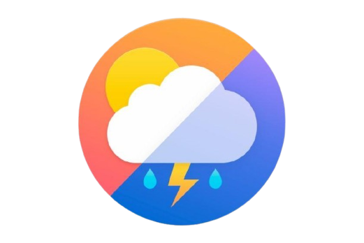
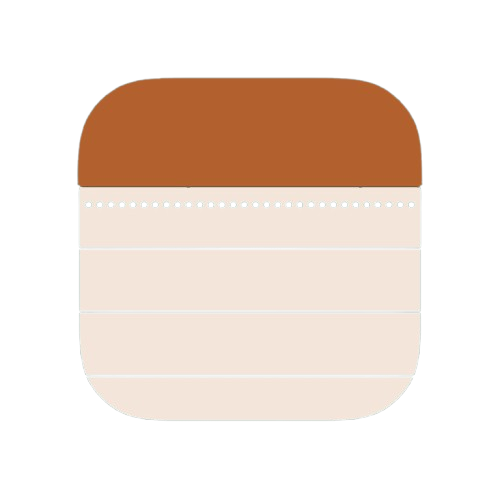

# Android Apps 


This repository contains various Android applications developed using Flutter. Serves as a collection of Android applications built for different purposes, including utilities, productivity, and experimental projects. Each application has its own folder containing Read me, source code, assets, and other required documents.


<p align="center">
  <a href="https://flutter.dev"></a>
  <a href="https://developer.android.com"></a>
  <a href="https://opensource.org/licenses/MIT"></a>
  <a href="https://github.com/Dheeraj-Chintala/Android-Apps/issues"></a>
  <a href="https://github.com/Dheeraj-Chintala/Android-Apps/stargazers"></a>
</p>

---

##  Features

- Modular structure for multiple Flutter apps
- Compatible with Android (API 21+)
- Follows best practices in UI/UX and code organization
- Easy-to-navigate directory and documentation
- Used various technologies like google maps, G-drive etc
- Integrated Artificial Intelligence
---

## Apps
<div align="center">
  <a href="savourai">  
</a>
<a href="hiveShare/gdg_solution">
        
</a>
  <a href="shadowchat">
      

  </a>
  

  <a href="fitness_app">
        

  </a>
  <a href="instanews">
      

  </a>
  <a href="moviesfusion">
      

  </a>
  <a href="weather">
        

  </a>
    <a href="shmart">
        

  </a>
    <a href="drivenote">
      

  </a>

  <a href="cram">
         

  </a>


    
    


</div>

##  Getting Started

To run any of the apps:

1. Clone the repository:
   ```bash
   git clone https://github.com/Dheeraj-Chintala/Android-Apps.git
   cd app_Name
2. Get dependencies:
   ```bash
   flutter pub get
3. Run
   ```bash
   flutter run
   
