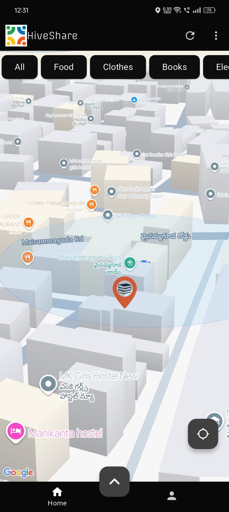
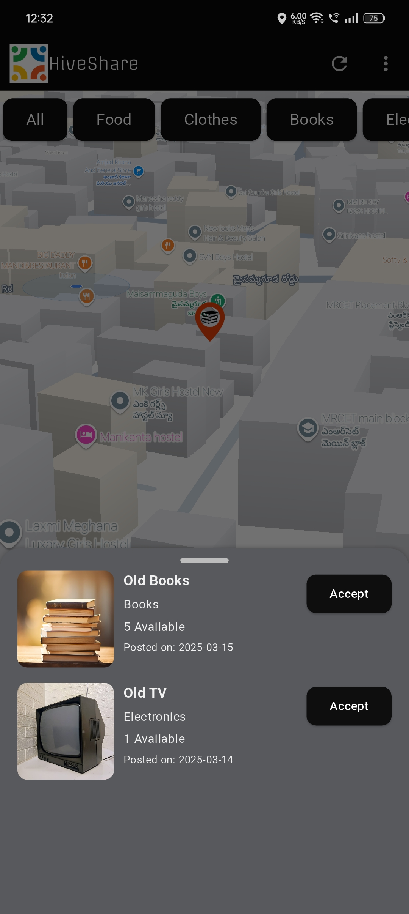
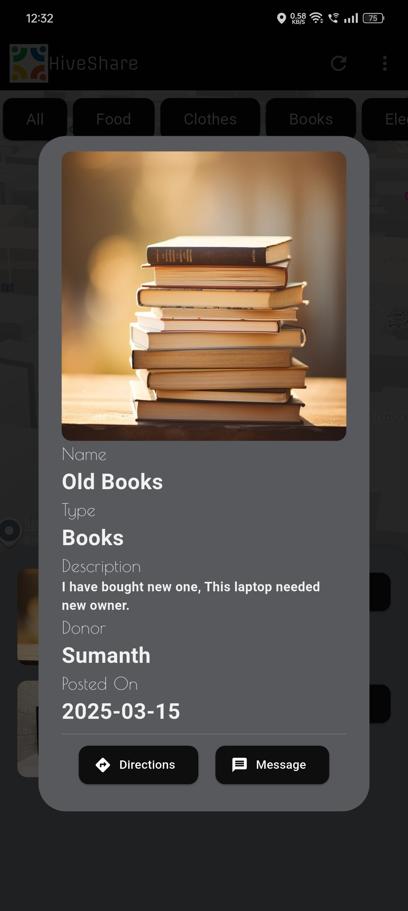
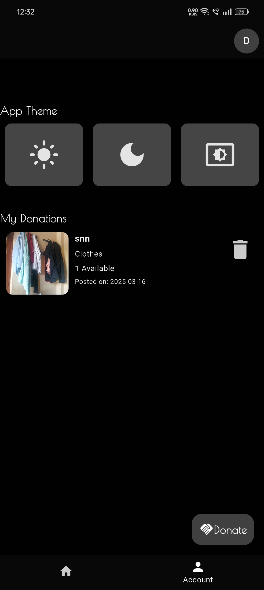
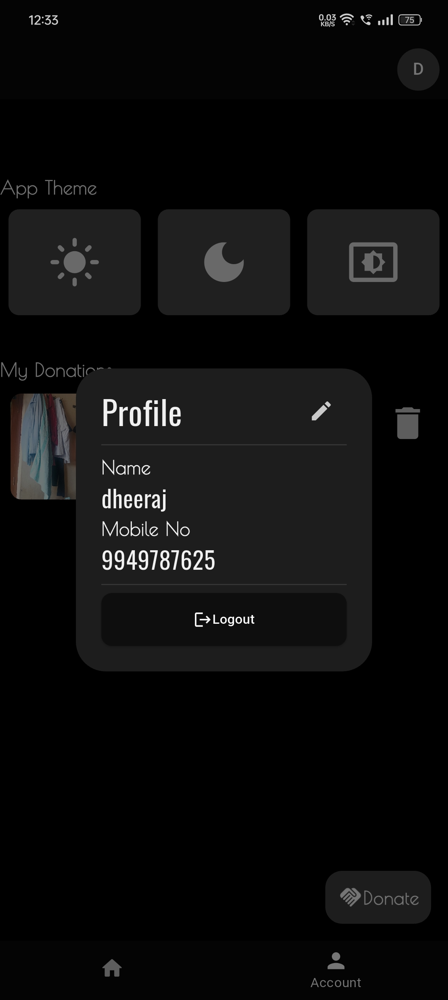
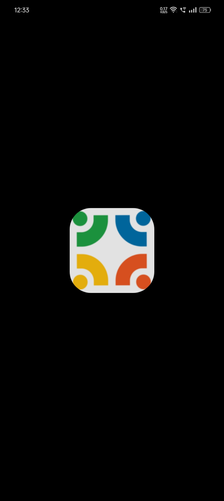

# HiveShare -Donation Sharing App


 This mobile application is built for the **Google Developer Groups (GDG) Solution Challenge 2025**. This app empowers communities by allowing individuals to **donate leftover food, clothes, electronics, and more** to those in need. Users can view donation posts nearby, connect with donors/receivers, and contribute to reducing waste while helping others.

---
##  Features

-  **Nearby Donations Map** – View available donations near your location.
-  **Image Uploads** – Post items with photos and descriptions.
-  **Secure Sign-In** – Google sign-in using Firebase Authentication.
-  **Chat System** – Communicate with donors/receivers securely.
-  **Categories** – Organize donations (Food, Clothes, Electronics, Others).
-  **Expiry System** – Donations expire automatically after a set time.


## Screenshots


### Visualizing nearby donations with 3D Map 
<div>
  
  
</div>

### App Interfaces
<div>
  
  
</div>
<div>
  
  
</div>

---

##  Tech Stack

| Layer       | Tech Used                      |
|-------------|--------------------------------|
| **Frontend**| Flutter, Riverpod, Google Maps |
| **Backend** | Firebase Firestore & Storage   |
| **Auth**    | Firebase Authentication        |
| **APIs**    | Google Maps API, Geolocation   |


---

## Getting Started
1. Clone Repository
   ```bash
   git clone https://www.github.com/Dheeeraj-Chintala/Android-Apps.git
   cd hiveShare/gdg_solution
2. Get dependencies
   ```bash
   flutter pub get
3. Run
   ```bash
   flutter run
